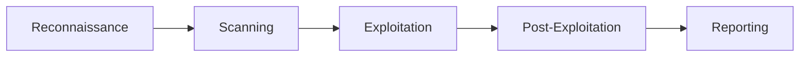

# Red Team Fundamentals

A beginner's guide to offensive security methodology.

## The Penetration Testing Phases



| Phase | Description |
|:------|:------------|
| **Reconnaissance** | Gather information about the target (OSINT, DNS, social engineering) |
| **Scanning** | Identify live hosts, open ports, and services (Nmap, vulnerability scanners) |
| **Exploitation** | Gain initial access using vulnerabilities or misconfigurations |
| **Post-Exploitation** | Escalate privileges, move laterally, maintain access, exfiltrate data |
| **Reporting** | Document findings, evidence, and remediation recommendations |

---

## Essential Tools by Phase

### Reconnaissance
| Tool | Purpose |
|:-----|:--------|
| `nmap` | Network scanning and service detection |
| `gobuster/ffuf` | Directory and subdomain brute-forcing |
| `theHarvester` | Email and subdomain enumeration |
| `shodan` | Internet-connected device search |

### Scanning
| Tool | Purpose |
|:-----|:--------|
| `Shodan` | Internet-connected device search |

### Exploitation
| Tool | Purpose |
|:-----|:--------|
| `Metasploit` | Exploitation framework |
| `msfvenom` | Payload generation |
| `Burp Suite` | Web application testing |
| `sqlmap` | SQL injection automation |

### Post-Exploitation
| Tool | Purpose |
|:-----|:--------|
| `linpeas/winpeas` | Privilege escalation enumeration |
| `Mimikatz` | Credential extraction (Windows) |
| `BloodHound` | Active Directory attack paths |
| `Chisel` | Pivoting and tunneling |

---

## Setting Up Your Lab

### Recommended Practice Platforms
| Platform | URL | Description |
|:---------|:----|:------------|
| **HackTheBox** | [hackthebox.com](https://www.hackthebox.com/) | Realistic vulnerable machines |
| **TryHackMe** | [tryhackme.com](https://tryhackme.com/) | Guided learning paths |
| **VulnHub** | [vulnhub.com](https://www.vulnhub.com/) | Downloadable vulnerable VMs |
| **PentesterLab** | [pentesterlab.com](https://pentesterlab.com/) | Web exploitation exercises |

### Local Lab Setup
```bash
# Essential VMs to download:
# - Kali Linux (attacker machine)
# - Metasploitable 2/3 (vulnerable Linux)
# - Windows 10/Server (for AD labs)
# - DVWA, bWAPP, OWASP WebGoat (web apps)
```

---

## Quick Reference: Common Ports

| Port | Service | Notes |
|:-----|:--------|:------|
| 21 | FTP | Check anonymous login |
| 22 | SSH | Brute-force, keys |
| 23 | Telnet | Cleartext credentials |
| 25 | SMTP | User enumeration |
| 53 | DNS | Zone transfers |
| 80/443 | HTTP/HTTPS | Web vulnerabilities |
| 139/445 | SMB | EternalBlue, shares |
| 3306 | MySQL | Default creds |
| 3389 | RDP | Brute-force |
| 5985 | WinRM | Evil-WinRM |

---

## Methodology Checklists

### Web Application Testing
- [ ] Run directory brute-force (`gobuster`, `ffuf`)
- [ ] Check for default credentials
- [ ] Test for SQL injection
- [ ] Test for XSS
- [ ] Check for file upload vulnerabilities
- [ ] Review source code and comments
- [ ] Check robots.txt and sitemap.xml

### Network Penetration Testing
- [ ] Identify live hosts
- [ ] Port scan all TCP ports
- [ ] Service version detection
- [ ] Vulnerability scanning
- [ ] Search for exploits (searchsploit)
- [ ] Attempt exploitation
- [ ] Privilege escalation
- [ ] Lateral movement

---

## Resources

- [OWASP Testing Guide](https://owasp.org/www-project-web-security-testing-guide/)
- [HackTricks](https://book.hacktricks.wiki/)
- [PayloadsAllTheThings](https://github.com/swisskyrepo/PayloadsAllTheThings)
- [GTFOBins](https://gtfobins.github.io/) (Linux privilege escalation)
- [LOLBAS](https://lolbas-project.github.io/) (Windows Living off the Land)
