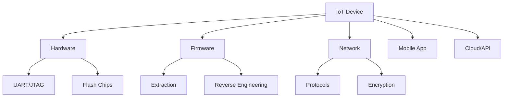

# IoT Hacking

Techniques for testing Internet of Things devices.

> [!CAUTION]
> Only test devices you own or have explicit authorization to test.

---

## IoT Attack Surface



---

## Hardware Attacks

### Finding Debug Interfaces

| Interface | Pins | Purpose |
|:----------|:-----|:--------|
| **UART** | TX, RX, GND | Serial console |
| **JTAG** | TDI, TDO, TCK, TMS, GND | Debug, flash |
| **SWD** | SWDIO, SWCLK, GND | ARM debugging |
| **SPI** | MISO, MOSI, CLK, CS | Flash memory |
| **I2C** | SDA, SCL | EEPROM access |

### Tools
- Multimeter (for pin identification)
- Logic analyzer
- Bus Pirate
- JTAGulator
- FTDI adapters

### UART Connection
```bash
# Find baud rate (common: 115200, 9600, 57600)
# Use screen or minicom
screen /dev/ttyUSB0 115200
minicom -D /dev/ttyUSB0 -b 115200
```

---

## Firmware Analysis

### Extraction Methods
| Method | Tool |
|:-------|:-----|
| Download from vendor | Web search |
| OTA update capture | Burp/mitmproxy |
| Flash chip dump | flashrom, SPI reader |
| JTAG/SWD dump | OpenOCD |

### Firmware Unpacking
```bash
# binwalk - extract embedded files
binwalk -e firmware.bin

# Extract filesystem
binwalk -e --run-as=root firmware.bin

# Check entropy (encryption detection)
binwalk -E firmware.bin
```

### Analysis
```bash
# Find strings
strings firmware.bin | grep -i password
strings firmware.bin | grep -i admin

# Find hardcoded credentials
grep -r "password" _extracted_folder/
grep -r "admin" _extracted_folder/

# Analyze with Ghidra or IDA
```

### Embedded Filesystems
| Filesystem | Common In |
|:-----------|:----------|
| SquashFS | Routers, cameras |
| JFFS2 | Embedded Linux |
| UBIFS | Flash storage |
| YAFFS | Older devices |

```bash
# Extract SquashFS
unsquashfs filesystem.squashfs
```

---

## Network Analysis

### Protocol Identification
| Protocol | Port | Security |
|:---------|:-----|:---------|
| MQTT | 1883/8883 | Often unauth |
| CoAP | 5683 | Limited security |
| Zigbee | - | Can be sniffed |
| Z-Wave | - | Encryption varies |
| BLE | - | Often weak |

### MQTT
```bash
# Subscribe to all topics
mosquitto_sub -h <broker> -t '#' -v

# Publish message
mosquitto_pub -h <broker> -t 'topic' -m 'message'
```

### Bluetooth Low Energy (BLE)
```bash
# Scan for devices
hcitool lescan

# Connect and enumerate
gatttool -b <MAC> -I
> connect
> primary
> characteristics
```

### ZigBee
```bash
# Use KillerBee
zbstumbler              # Find networks
zbdump -c 15 -w cap.pcap  # Capture traffic
```

---

## Common Vulnerabilities

| Vulnerability | Description |
|:--------------|:------------|
| Default credentials | admin:admin, root:root |
| Hardcoded secrets | Keys in firmware |
| Unencrypted updates | MITM attacks |
| Command injection | Web interfaces |
| Buffer overflows | Embedded services |
| Insecure protocols | Telnet, HTTP, MQTT |

---

## Web Interface Testing

```bash
# Find hidden pages
gobuster dir -u http://<device_ip> -w /usr/share/seclists/Discovery/Web-Content/common.txt

# Check default creds
# - admin/admin
# - admin/password
# - root/root
# - user/user

# Test for command injection
; id
| id
`id`
$(id)
```

---

## Tools

| Tool | Purpose |
|:-----|:--------|
| **binwalk** | Firmware extraction |
| **Ghidra** | Reverse engineering |
| **Wireshark** | Network analysis |
| **Burp Suite** | HTTP/API testing |
| **KillerBee** | ZigBee testing |
| **Ubertooth** | Bluetooth sniffing |
| **GATTacker** | BLE MITM |
| **EMBA** | Firmware analysis |
| **Firmware Mod Kit** | Firmware manipulation |

---

## Methodology

1. **Reconnaissance**
   - Identify device make/model
   - Find documentation, default creds
   - Download firmware if available

2. **Physical Access**
   - Open device, find debug ports
   - Dump flash if possible

3. **Firmware Analysis**
   - Extract and analyze filesystem
   - Find hardcoded secrets
   - Identify vulnerable services

4. **Network Testing**
   - Scan for open ports
   - Test protocols (MQTT, HTTP, etc.)
   - Check encryption

5. **Exploitation**
   - Try default credentials
   - Test command injection
   - Attempt authentication bypass

---

## Resources

- [OWASP IoT Top 10](https://owasp.org/www-project-internet-of-things/)
- [IoT Village](https://www.iotvillage.org/)
- [Practical IoT Hacking (Book)](https://nostarch.com/practical-iot-hacking)
